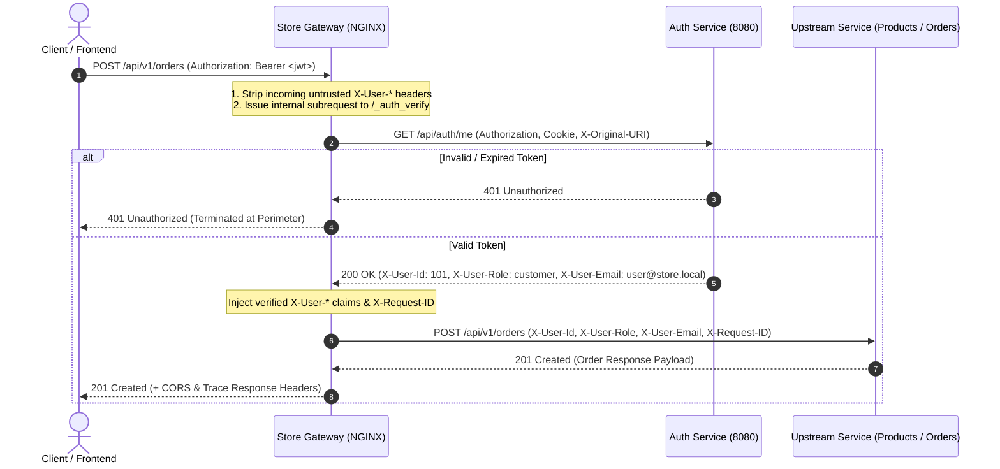
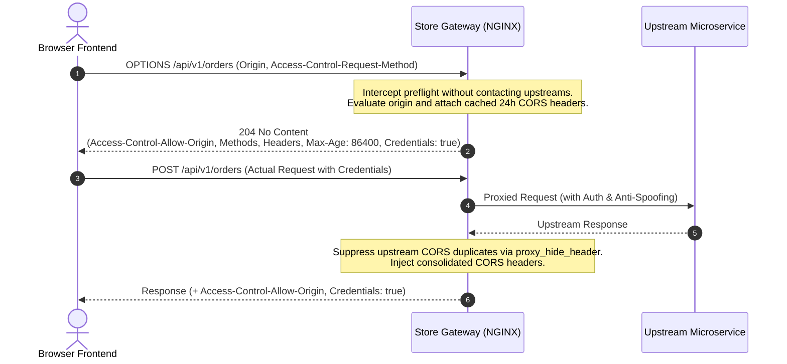

# Store Gateway (NGINX API Gateway)

`store_gateway` is the single entry point and high-performance reverse proxy for the microservice ecosystem (Auth Service, Product Service, Order Service, and User Service). It centralizes perimeter authentication offloading, anti-spoofing header sanitization, centralized CORS preflight caching, unified documentation proxying, and distributed request tracing.

---

## 🏛️ Architecture Overview

```
                                  CLIENTS
                       (Web Frontend, Mobile, Curl, Postman)
                                     │
                                     │ HTTP (Port 80 / $GATEWAY_PORT)
                                     ▼
                    ┌─────────────────────────────────┐
                    │       STORE_GATEWAY (NGINX)      │
                    ├─────────────────────────────────┤
                    │ • Centralized CORS (OPTIONS 204)│
                    │ • Anti-Spoofing (Strip X-User-* │
                    │ • Auth Offload Subrequests      │
                    │ • JWKS Pass-Through Routing     │
                    │ • Distributed Trace ID Injection│
                    │ • Unified Documentation Proxy   │
                    └───────┬─────────┬─────────┬─────┴─────────┐
                            │         │         │               │
    /api[/v1]/auth/*        │         │         │               │  /api[/v1]/users/*
    /docs/auth/*            │         │         │               │  /docs/users/*
    /.well-known/*          │         │         │               │
                            ▼         │         ▼               ▼
             ┌─────────────────────┐  │  ┌─────────────────────┐┌─────────────────────┐
             │    AUTH SERVICE     │  │  │    ORDER SERVICE    ││    USER SERVICE     │
             │ (auth-service:8080) │  │  │ (order-service:8060) ││ (user-service:8082) │
             ├─────────────────────┤  │  ├─────────────────────┤├─────────────────────┤
             │ • RS256 JWKS Key    │  │  │ • Order Management  ││ • User Profiles     │
             │   Distribution      │  │  │ • Offloaded Auth    ││ • Account Lifecycle │
             │ • Login / Register  │  │  │ • Scalar & Swagger  ││ • Notifications Feed│
             │ • Swagger UI        │  │  │ • OpenAPI Specs     ││ • Notification Prefs│
             └─────────────────────┘  │  └─────────────────────┘│ • Swagger & OpenAPI  │
                                      │                         └─────────────────────┘
                                      │  /api[/v1]/products/*
                                      │  /api[/v1]/admin/products/*
                                      │  /docs/products/*
                                      ▼
                        ┌─────────────────────┐
                        │   PRODUCT SERVICE   │
                        │(product-service:8040│
                        ├─────────────────────┤
                        │ • Product Catalog   │
                        │ • Admin Products    │
                        │ • Offloaded Auth    │
                        │ • Scalar & Swagger  │
                        └─────────────────────┘
```

---

## 🔄 Architectural Sequence Diagrams

### 1. Perimeter Authentication Offloading Flow



### 2. Centralized CORS Preflight Flow



---

## 🗺️ Route & Documentation Mapping Specification

| Gateway Route | Methods | Upstream Target | Auth Policy | Description |
|---|---|---|---|---|
| `GET /health` | `GET` | *Gateway Internal* | Public | Healthcheck probe returning `200 UP` (access log disabled) |
| `ALL /api/v1/auth/*` (or `/api/auth/*`) | `ANY` | `${AUTH_SERVICE_URL}/api/auth/*` | Public / Self-enforced | Login, register, token refresh cookies, user profile |
| `GET /.well-known/jwks.json` | `GET, OPTIONS` | `${AUTH_SERVICE_URL}/.well-known/jwks.json` | Public | RS256 JWKS public key set for token verification |
| `ALL /api/v1/products/*` (or `/api/products/*`) | `ANY` | `${PRODUCT_SERVICE_URL}/api/v1/products/*` | Mutation-Only Auth | Product catalog: `GET/HEAD` public; `POST/PUT/DELETE` require auth |
| `ALL /api/v1/admin/products/*` (or `/api/admin/products/*`) | `ANY` | `${PRODUCT_SERVICE_URL}/api/v1/admin/products/*` | Full Auth Offload | Admin product management: all methods require verified caller identity |
| `ALL /api/v1/orders/*` (or `/api/orders/*`) | `ANY` | `${ORDER_SERVICE_URL}/api/v1/orders/*` | Full Auth Offload | Order processing: all mutations require verified caller identity |
| `ALL /api/v1/users/*` (or `/api/users/*`) | `ANY` | `${USER_SERVICE_URL}/api/users/*` | Full Auth Offload | User profile, notifications, preferences, and account lifecycle |
| `GET /docs` | `GET` | *Gateway Internal* | Conditional (`ENABLE_DOCS`) | Unified API Documentation Hub landing page (HTML) |
| `GET /docs/auth` | `GET` | `${AUTH_SERVICE_URL}/docs/` | Conditional (`ENABLE_DOCS`) | Auth Service Swagger UI (302 redirects to `/docs/auth/`) |
| `GET /docs/auth/openapi.yaml` | `GET` | `${AUTH_SERVICE_URL}/docs/openapi.yaml` | Conditional (`ENABLE_DOCS`) | Auth Service raw OpenAPI YAML schema |
| `GET /docs/products/scalar` (or `/docs/products`) | `GET` | `${PRODUCT_SERVICE_URL}/docs/` | Conditional (`ENABLE_DOCS`) | Product Service modern Scalar documentation UI |
| `GET /docs/products/swagger` | `GET` | `${PRODUCT_SERVICE_URL}/swagger/` | Conditional (`ENABLE_DOCS`) | Product Service classic Swagger documentation UI |
| `GET /docs/products/openapi.json` | `GET` | `${PRODUCT_SERVICE_URL}/openapi.json` | Conditional (`ENABLE_DOCS`) | Product Service raw OpenAPI JSON schema |
| `GET /docs/products/openapi.yaml` | `GET` | `${PRODUCT_SERVICE_URL}/openapi.yaml` | Conditional (`ENABLE_DOCS`) | Product Service raw OpenAPI YAML schema |
| `GET /docs/orders/scalar` (or `/docs/orders`) | `GET` | `${ORDER_SERVICE_URL}/docs` | Conditional (`ENABLE_DOCS`) | Order Service modern Scalar documentation UI |
| `GET /docs/orders/swagger` | `GET` | `${ORDER_SERVICE_URL}/swagger` | Conditional (`ENABLE_DOCS`) | Order Service classic Swagger documentation UI |
| `GET /docs/orders/openapi.json` | `GET` | `${ORDER_SERVICE_URL}/docs/openapi.json` | Conditional (`ENABLE_DOCS`) | Order Service raw OpenAPI JSON schema |
| `GET /docs/orders/openapi.yaml` | `GET` | `${ORDER_SERVICE_URL}/docs/openapi.yaml` | Conditional (`ENABLE_DOCS`) | Order Service raw OpenAPI YAML schema |
| `GET /docs/users` (or `/docs/users/swagger`) | `GET` | `${USER_SERVICE_URL}/swagger` | Conditional (`ENABLE_DOCS`) | User Service interactive Swagger documentation UI |
| `GET /docs/users/openapi.json` | `GET` | `${USER_SERVICE_URL}/docs/openapi.json` | Conditional (`ENABLE_DOCS`) | User Service raw OpenAPI JSON schema |
| `GET /docs/users/openapi.yaml` | `GET` | `${USER_SERVICE_URL}/docs/openapi.yaml` | Conditional (`ENABLE_DOCS`) | User Service raw OpenAPI YAML schema |

---

## 🔐 Core Architectural Domains

### 1. Perimeter Authentication Offloading
- Protected routes evaluate caller credentials by executing an internal subrequest to `${AUTH_SERVICE_URL}/api/auth/me`.
- **Full Auth Offload (`snippets/auth-offload.conf`)**: Enforces authentication on all non-OPTIONS requests.
- **Mutation-Only Offload (`snippets/auth-offload-mutation.conf`)**: Allows `GET`, `HEAD`, and `OPTIONS` requests to pass through anonymously, while requiring verified credentials for mutating operations (`POST`, `PUT`, `PATCH`, `DELETE`).
- **Claim Injection**: Upon successful auth verification (HTTP 200), claims from the auth response (`X-User-Id`, `X-User-Role`, `X-User-Email`) are extracted and injected into the downstream proxy request.
- **Perimeter Rejection**: If authentication fails, the gateway rejects the caller with HTTP 401 Unauthorized immediately, shielding upstream microservices from unauthenticated traffic.

### 2. Anti-Spoofing Header Sanitization (`snippets/anti-spoofing.conf`)
- The gateway strips all incoming client headers prefixed with `X-User-` (`X-User-Id`, `X-User-Email`, `X-User-Role`, `X-User-Permissions`).
- Only verified claims produced by the gateway's internal authentication subrequest are forwarded downstream, preventing privilege escalation.

### 3. Centralized CORS Management (`snippets/cors.conf`)
- Intercepts all browser `OPTIONS` preflight requests and immediately responds with `204 No Content`.
- Caches preflight responses for 24 hours (`Access-Control-Max-Age: 86400`).
- Dynamically matches incoming `Origin` against `CORS_ALLOWED_ORIGIN_REGEX` environment variable, safely reflecting allowed origins instead of insecure `*` wildcards.
- Supports credentials (`Access-Control-Allow-Credentials: true`) when request origin matches the configured regex.
- Suppresses upstream CORS headers using `proxy_hide_header Access-Control-Allow-Origin` to avoid duplicate header parsing errors in browsers.

### 4. Unified Documentation Proxying
- Proxies interactive documentation UIs (Scalar UI and Swagger UI) and raw schema files (JSON and YAML) across all microservices.
- Gated by the `ENABLE_DOCS` environment variable: when set to `false`, `0`, or `off`, all documentation endpoints return `404 Not Found` for production security.

### 5. Distributed Tracing & Defense-in-Depth (`snippets/security-headers.conf`)
- Generates a unique `$req_id` (UUID format) if omitted by client and attaches it as `X-Request-ID` across downstream requests, upstream logs, and client response headers.
- Emits baseline security headers on every response:
  - `X-Content-Type-Options: nosniff`
  - `X-Frame-Options: SAMEORIGIN`
  - `X-XSS-Protection: 1; mode=block`

---

## ⚙️ Environment Variables Reference

| Variable Name | Required | Default | Description | Example |
|---|---|---|---|---|
| `GATEWAY_PORT` | Optional | `80` | Port on which NGINX listens for incoming client requests | `80` or `8000` |
| `ENABLE_DOCS` | Optional | `true` | Toggles documentation endpoints (`/docs*`). Set to `false`, `0`, or `off` to disable | `true` or `false` |
| `CORS_ALLOWED_ORIGIN_REGEX` | Optional | `^https?://(localhost\|127\.0\.0\.1)(:[0-9]+)?$` | Regular expression matching allowed client `Origin` headers for CORS reflection and credential support | `^https?://(localhost\|127\.0\.0\.1\|yourdomain\.com)(:[0-9]+)?$` |
| `AUTH_SERVICE_URL` | **Required** | *None* | Base HTTP URL of the upstream Auth Service | `http://localhost:8080` or `http://auth-service:8080` |
| `PRODUCT_SERVICE_URL` | **Required** | *None* | Base HTTP URL of the upstream Product Service | `http://localhost:8040` or `http://product-service:8040` |
| `ORDER_SERVICE_URL` | **Required** | *None* | Base HTTP URL of the upstream Order Service | `http://localhost:8060` or `http://order-service:8060` |
| `USER_SERVICE_URL` | **Required** | *None* | Base HTTP URL of the upstream User Service | `http://localhost:8082` or `http://user-service:8082` |
| `CLOUDFLARE_TUNNEL_TOKEN` | Optional | *None* | Authentication token for embedded Cloudflare Tunnel (`cloudflared`). When supplied, starts an outbound tunnel to Cloudflare Edge | `eyJhIjoi...` |

---

## 🚀 Quick Start (Standalone Deployment)

### 1. Copy Environment Configuration
```bash
cp .env.example .env
```

Configure `.env` with your downstream service hostnames, CORS pattern, and ports:
```ini
# Gateway Configuration
GATEWAY_PORT=80
ENABLE_DOCS=true

# Downstream Microservices
AUTH_SERVICE_URL=http://auth-service:8080
PRODUCT_SERVICE_URL=http://product-service:8040
ORDER_SERVICE_URL=http://order-service:8060
USER_SERVICE_URL=http://user-service:8082

# Allowed Origins Regex for CORS
CORS_ALLOWED_ORIGIN_REGEX=^https?://(localhost|127\.0\.0\.1|([a-zA-Z0-9-]+\.)*yourdomain\.com)(:[0-9]+)?$

# Cloudflare Tunnel Token (optional)
CLOUDFLARE_TUNNEL_TOKEN=
```

### 2. Build and Run Standalone Docker Container
```bash
# Build the gateway image
docker build -t store_gateway .

# Run standalone container
docker run -d \
  --name store_gateway \
  -p 80:80 \
  --env-file .env \
  store_gateway
```

### 3. Verify Gateway Readiness
```bash
curl http://localhost/health
```

---

## 📦 Standalone Podman Deployment Guide

Podman allows rootless container management without requiring Docker daemon. You can deploy `store_gateway` and downstream microservices using either **User Networks** or **Podman Pods**.

### Approach A: Standalone Containers on a Podman Network

This approach uses a dedicated bridge network for service discovery by container name.

```bash
# 1. Create a user-defined Podman network
podman network create store_net

# 2. Run downstream microservices on the network
podman run -d --name auth-service --network store_net -e PORT=8080 store_auth:latest
podman run -d --name product-service --network store_net -e PORT=8040 product_service:latest
podman run -d --name order-service --network store_net -e PORT=8060 order_service:latest
podman run -d --name user-service --network store_net -e PORT=8082 user_service:latest

# 3. Build and run store_gateway connected to the network
podman build -t store_gateway .

podman run -d \
  --name store_gateway \
  --network store_net \
  -p 8000:80 \
  -e GATEWAY_PORT=80 \
  -e CORS_ALLOWED_ORIGIN_REGEX="^https?://(localhost|127\.0\.0\.1|yourdomain\.com|.+\.yourdomain\.com)(:[0-9]+)?$" \
  -e AUTH_SERVICE_URL=http://auth-service:8080 \
  -e PRODUCT_SERVICE_URL=http://product-service:8040 \
  -e ORDER_SERVICE_URL=http://order-service:8060 \
  -e USER_SERVICE_URL=http://user-service:8082 \
  -e ENABLE_DOCS=true \
  store_gateway

# 4. Check gateway status
curl http://localhost:8000/health
```

---

### Approach B: Podman Pod (Shared Network Namespace)

In a Podman Pod, all containers share `localhost` networking and port namespaces, eliminating the need for inter-container DNS.

```bash
# 1. Create a Pod exposing gateway port (8000) and frontend port (3000)
podman pod create \
  --name store_pod \
  -p 8000:80 \
  -p 3000:3000

# 2. Launch microservices inside the pod (binding to localhost ports)
podman run -d --pod store_pod --name auth-service -e PORT=8080 store_auth:latest
podman run -d --pod store_pod --name product-service -e PORT=8040 product_service:latest
podman run -d --pod store_pod --name order-service -e PORT=8060 order_service:latest
podman run -d --pod store_pod --name user-service -e PORT=8082 user_service:latest
podman run -d --pod store_pod --name frontend-app -e PORT=3000 frontend:latest

# 3. Launch store_gateway inside the pod pointing to localhost upstreams
podman run -d \
  --pod store_pod \
  --name store_gateway \
  -e GATEWAY_PORT=80 \
  -e CORS_ALLOWED_ORIGIN_REGEX="^https?://(localhost|127\.0\.0\.1|yourdomain\.com|.+\.yourdomain\.com)(:[0-9]+)?$" \
  -e AUTH_SERVICE_URL=http://127.0.0.1:8080 \
  -e PRODUCT_SERVICE_URL=http://127.0.0.1:8040 \
  -e ORDER_SERVICE_URL=http://127.0.0.1:8060 \
  -e USER_SERVICE_URL=http://127.0.0.1:8082 \
  -e ENABLE_DOCS=true \
  store_gateway
```

---

## 🌐 Host Edge NGINX Reverse-Proxy Configuration

In production single-server deployments, a **Host Edge NGINX** instance terminates SSL/TLS (e.g. via Let's Encrypt / Certbot) and proxies public traffic to the frontend and API gateway containers.

```
                    Internet (HTTPS 443)
                             │
            ┌────────────────┴────────────────┐
            ▼                                 ▼
   https://yourdomain.com           https://api.yourdomain.com
            │                                 │
  ┌─────────────────────────────────────────────────────┐
  │              HOST EDGE NGINX (Host OS)              │
  │        (SSL Termination, HTTP/2, Certbot)           │
  └─────────┬─────────────────────────────────┬─────────┘
            │ proxy_pass                      │ proxy_pass
            ▼ http://127.0.0.1:3000           ▼ http://127.0.0.1:8000
    ┌───────────────┐                 ┌───────────────┐
    │ Frontend App  │                 │ STORE GATEWAY │
    │  (Container)  │                 │  (Container)  │
    └───────────────┘                 └───────────────┘
```

### Sample Host Edge NGINX Server Block (`/etc/nginx/sites-available/store.conf`)

```nginx
# 1. Redirect HTTP to HTTPS for all domains
server {
    listen 80;
    listen [::]:80;
    server_name yourdomain.com www.yourdomain.com api.yourdomain.com;
    return 301 https://$host$request_uri;
}

# 2. Frontend Application (yourdomain.com)
server {
    listen 443 ssl http2;
    listen [::]:443 ssl http2;
    server_name yourdomain.com www.yourdomain.com;

    # SSL Certificates (managed by Certbot)
    ssl_certificate /etc/letsencrypt/live/yourdomain.com/fullchain.pem;
    ssl_certificate_key /etc/letsencrypt/live/yourdomain.com/privkey.pem;
    include /etc/letsencrypt/options-ssl-nginx.conf;
    ssl_dhparam /etc/letsencrypt/ssl-dhparams.pem;

    client_max_body_size 20M;

    location / {
        proxy_pass http://127.0.0.1:3000;
        proxy_http_version 1.1;

        proxy_set_header Upgrade $http_upgrade;
        proxy_set_header Connection "upgrade";
        proxy_set_header Host $host;
        proxy_set_header X-Real-IP $remote_addr;
        proxy_set_header X-Forwarded-For $proxy_add_x_forwarded_for;
        proxy_set_header X-Forwarded-Proto $scheme;
        proxy_set_header X-Forwarded-Host $host;
        proxy_set_header X-Forwarded-Port $server_port;

        proxy_cache_bypass $http_upgrade;
        proxy_read_timeout 60s;
    }
}

# 3. API Gateway Backend (api.yourdomain.com)
server {
    listen 443 ssl http2;
    listen [::]:443 ssl http2;
    server_name api.yourdomain.com;

    # SSL Certificates (managed by Certbot)
    ssl_certificate /etc/letsencrypt/live/yourdomain.com/fullchain.pem;
    ssl_certificate_key /etc/letsencrypt/live/yourdomain.com/privkey.pem;
    include /etc/letsencrypt/options-ssl-nginx.conf;
    ssl_dhparam /etc/letsencrypt/ssl-dhparams.pem;

    client_max_body_size 50M;

    location / {
        # Proxy to store_gateway container port
        proxy_pass http://127.0.0.1:8000;
        proxy_http_version 1.1;

        proxy_set_header Host $host;
        proxy_set_header X-Real-IP $remote_addr;
        proxy_set_header X-Forwarded-For $proxy_add_x_forwarded_for;
        proxy_set_header X-Forwarded-Proto $scheme;
        proxy_set_header X-Forwarded-Host $host;
        proxy_set_header X-Forwarded-Port $server_port;

        # WebSocket support (for realtime notifications if enabled)
        proxy_set_header Upgrade $http_upgrade;
        proxy_set_header Connection $connection_upgrade;

        proxy_read_timeout 90s;
        proxy_buffering off;
    }
}
```

---

## ☁️ Cloudflare Tunnel Deployment & DNS CNAME Setup

When deploying `store_gateway` in local development, home/office networks (CGNAT), or private cloud VPCs without public ingress, you can use the **embedded Cloudflare Tunnel** to securely expose your API without opening any router or firewall ports.

```
[Client / Browser: https://api.yourdomain.com]
                       │
                       ▼
             [Cloudflare Edge Network]
         (DDoS Protection, WAF, SSL Termination)
                       │
                       ▲ (Outbound Encrypted Tunnel)
                       │ (Bypasses CGNAT & Firewalls)
         ┌─────────────┴──────────────────────────────┐
         │       STORE_GATEWAY CONTAINER              │
         │                                            │
         │   [cloudflared (background)]               │
         │               │                            │
         │               ▼ (http://localhost:80)      │
         │   [NGINX Gateway Router (foreground)]      │
         │               │                            │
         │       ┌───────┴───────┐                    │
         │       ▼               ▼                    │
         │   Auth Service   Product Service ...       │
         └────────────────────────────────────────────┘
```

### 1. Cloudflare Zero Trust Configuration

1. Log into the [Cloudflare Zero Trust Dashboard](https://one.dash.cloudflare.com/).
2. Navigate to **Networks** ➔ **Tunnels** ➔ **Add a tunnel**.
3. Select **Cloudflare** (Connector) and give it a name (e.g. `store-gateway-tunnel`).
4. **Copy the Connector Token (`eyJhIjoi...`)**:
   - Under **Install and run a connector**, select **Docker** (or any OS).
   - Copy the long token string starting with `eyJh...` and paste it into your `.env` as `CLOUDFLARE_TUNNEL_TOKEN`.
   - *(Note: Do not confuse the Connector Token with the Tunnel UUID; the token is the Base64 JWT required for the container to authenticate).*
5. **Configure Public Hostname**:
   - Switch to the **Public Hostname** tab in your tunnel settings.
   - **Subdomain**: `api`
   - **Domain**: `yourdomain.com` (or your registered domain)
   - **Service Type**: **`HTTP`** *(do NOT select `HTTPS`)*
   - **URL**: `localhost:80` (or `127.0.0.1:80`)
6. Save the hostname. Cloudflare will automatically manage the `CNAME` record pointing `api.yourdomain.com` to `<tunnel-uuid>.cfargotunnel.com` with proxying enabled (🟠).

> [!IMPORTANT]
> **Service Type Must Be `HTTP`**:
> NGINX inside the container listens for plain HTTP on port 80, while Cloudflare Edge terminates public HTTPS/SSL. Selecting `HTTPS` in Zero Trust causes `cloudflared` to attempt a TLS handshake against port 80, resulting in `502 Bad Gateway` (`tls: first record does not look like a TLS handshake`).

### 2. Run Container with Cloudflare Tunnel

Once `CLOUDFLARE_TUNNEL_TOKEN` is set in your `.env` file, start the container:

**Using Docker:**
```bash
# Build the image with embedded cloudflared
docker build -t store_gateway .

# Run with environment file
docker run -d \
  --name store_gateway \
  --restart unless-stopped \
  -p 80:80 \
  -p 8000:80 \
  --env-file .env \
  store_gateway
```

**Using Podman (on existing `store-network`):**
```bash
# Build the image
podman build -t store_gateway .

# Run on the store network alongside microservices
podman run -d \
  --name store_gateway \
  --network store-network \
  --restart unless-stopped \
  -p 80:80 \
  -p 8000:80 \
  --env-file .env \
  store_gateway
```

> **Note**: If `CLOUDFLARE_TUNNEL_TOKEN` is omitted or empty, the container gracefully falls back to standalone NGINX mode.

---

## 🧪 Local Testing & Verification

### Run Automated Test Suite
```bash
npm test
```

### Manual Verification Curl Recipes

```bash
# 1. Health Probe (Expect 200 OK JSON {"status":"UP","service":"store_gateway"})
curl -i http://localhost/health

# 2. CORS Preflight Check - Localhost (Expect 204 No Content with CORS allow headers)
curl -i -X OPTIONS http://localhost/api/v1/orders \
  -H "Origin: http://localhost:3000" \
  -H "Access-Control-Request-Method: POST"

# 2b. CORS Preflight Check - Custom Domain (When CORS_ALLOWED_ORIGIN_REGEX matches yourdomain.com)
curl -i -X OPTIONS http://localhost/api/v1/orders \
  -H "Origin: https://yourdomain.com" \
  -H "Access-Control-Request-Method: POST"

# 3. RS256 JWKS Public Key Retrieval (Expect 200 OK with JWKS JSON)
curl -i http://localhost/.well-known/jwks.json

# 4. Public Product Catalog Access (Expect 200 OK without token)
curl -i http://localhost/api/v1/products

# 5. Protected Product Creation Without Token (Expect 401 Unauthorized)
curl -i -X POST http://localhost/api/v1/products \
  -H "Content-Type: application/json" \
  -d '{"title":"New Product","price":29.99}'

# 6. Admin Product Access Without Token (Expect 401 Unauthorized)
curl -i http://localhost/api/v1/admin/products

# 7. Anti-Spoofing Check: Fake X-User-Role on Mutating Route (Expect 401 Unauthorized)
curl -i -X POST http://localhost/api/v1/orders \
  -H "X-User-Role: admin" \
  -H "Content-Type: application/json" \
  -d '{"items":[{"id":"item-1","qty":2}]}'

# 8. Authenticated Order Creation (Expect 201 Created with verified claims forwarded)
curl -i -X POST http://localhost/api/v1/orders \
  -H "Authorization: Bearer <valid_jwt_token>" \
  -H "Content-Type: application/json" \
  -d '{"items":[{"id":"item-1","qty":2}]}'

# 9. Authenticated Admin Product Creation (Expect 201 Created with verified claims forwarded)
curl -i -X POST http://localhost/api/v1/admin/products \
  -H "Authorization: Bearer <valid_admin_token>" \
  -H "Content-Type: application/json" \
  -d '{"title":"Admin Added Product","price":49.99}'

# 10. Authenticated User Profile Retrieval (Expect 200 OK with User Profile)
curl -i http://localhost/api/v1/users/profile \
  -H "Authorization: Bearer <valid_jwt_token>"

# 11. Unauthenticated User Route Access (Expect 401 Unauthorized)
curl -i http://localhost/api/v1/users/profile

# 12. Unified Documentation Hub (Expect 200 OK HTML)
curl -i http://localhost/docs

# 13. User Service Swagger UI Proxy (Expect 200 OK HTML)
curl -i http://localhost/docs/users/swagger

# 14. User Service OpenAPI YAML Schema (Expect 200 OK YAML)
curl -i http://localhost/docs/users/openapi.yaml
```

---

## 📁 File Structure

```
store_gateway/
├── Dockerfile                           # Lean Alpine-based NGINX + cloudflared container image
├── .env.example                         # Environment variable template
├── .gitignore                           # Git ignore rules (protects .env and .agent)
├── .dockerignore                        # Docker build ignore rules
├── scripts/
│   └── 40-start-cloudflared.sh          # Container startup hook for Cloudflare Tunnel
├── nginx/
│   ├── nginx.conf                       # Main NGINX context with trace ID mapping & logging
│   ├── templates/
│   │   └── default.conf.template        # Dynamic virtual host envsubst template
│   └── snippets/
│       ├── cors.conf                    # Centralized CORS & OPTIONS 204 preflight handler
│       ├── anti-spoofing.conf           # Anti-spoofing sanitization (strips client X-User-*)
│       ├── auth-offload.conf            # Full perimeter auth offloading & claim injection
│       ├── auth-offload-mutation.conf   # Mutation-only auth offloading for public read routes
│       ├── proxy-params.conf            # Reverse proxy headers, connection reuse & trace ID
│       └── security-headers.conf        # Defense-in-depth security response headers
├── tests/
│   ├── auth-flow.test.mjs               # E2E authentication offload and anti-spoofing tests
│   └── gateway-spec.test.mjs            # NGINX configuration and route contract tests
├── package.json                         # Automated test scripts and dependencies
└── README.md                            # Comprehensive documentation & developer guide
```

