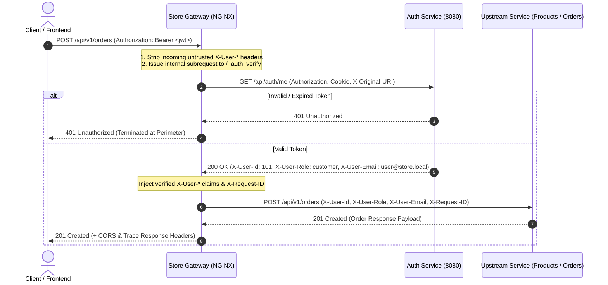
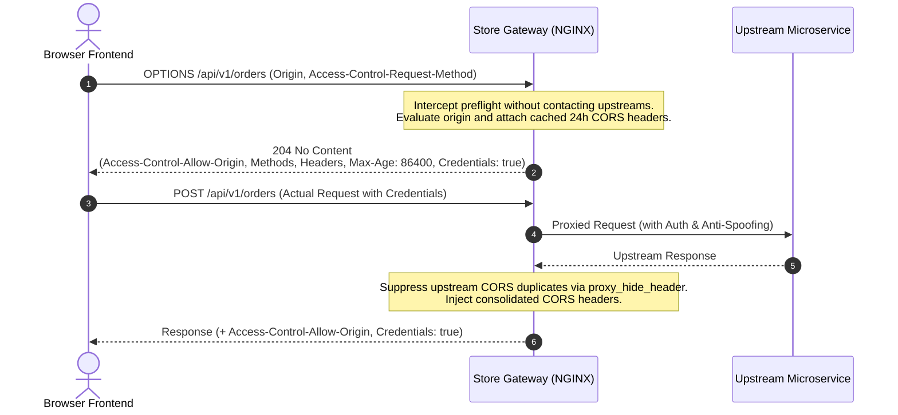

# Store Gateway (NGINX API Gateway)

`store_gateway` is the single entry point and high-performance reverse proxy for the microservice ecosystem (Auth Service, Product Service, and Order Service). It centralizes perimeter authentication offloading, anti-spoofing header sanitization, centralized CORS preflight caching, unified documentation proxying, and distributed request tracing.

---

## 🏛️ Architecture Overview

```
                                  CLIENTS
                       (Web Frontend, Mobile, Curl, Postman)
                                     │
                                     │ HTTP (Port 80 / $GATEWAY_PORT)
                                     ▼
                    ┌─────────────────────────────────┐
                    │       STORE_GATEWAY (NGINX)      │
                    ├─────────────────────────────────┤
                    │ • Centralized CORS (OPTIONS 204)│
                    │ • Anti-Spoofing (Strip X-User-* │
                    │ • Auth Offload Subrequests      │
                    │ • JWKS Pass-Through Routing     │
                    │ • Distributed Trace ID Injection│
                    │ • Unified Documentation Proxy   │
                    └───────┬─────────┬─────────┬─────┘
                            │         │         │
    /api[/v1]/auth/*        │         │         │  /api[/v1]/orders/*
    /docs/auth/*            │         │         │  /docs/orders/*
    /.well-known/*          │         │         │
                            ▼         │         ▼
             ┌─────────────────────┐  │  ┌─────────────────────┐
             │    AUTH SERVICE     │  │  │    ORDER SERVICE    │
             │ (auth-service:8080) │  │  │ (order-service:8060) │
             ├─────────────────────┤  │  ├─────────────────────┤
             │ • RS256 JWKS Key    │  │  │ • Order Management  │
             │   Distribution      │  │  │ • Offloaded Auth    │
             │ • Login / Register  │  │  │ • Scalar & Swagger  │
             │ • Swagger UI        │  │  │ • OpenAPI Specs     │
             └─────────────────────┘  │  └─────────────────────┘
                                      │
                                      │  /api[/v1]/products/*
                                      │  /docs/products/*
                                      ▼
                        ┌─────────────────────┐
                        │   PRODUCT SERVICE   │
                        │(product-service:8040│
                        ├─────────────────────┤
                        │ • Product Catalog   │
                        │ • Offloaded Auth    │
                        │ • Scalar & Swagger  │
                        └─────────────────────┘
```

---

## 🔄 Architectural Sequence Diagrams

### 1. Perimeter Authentication Offloading Flow



### 2. Centralized CORS Preflight Flow



---

## 🗺️ Route & Documentation Mapping Specification

| Gateway Route | Methods | Upstream Target | Auth Policy | Description |
|---|---|---|---|---|
| `GET /health` | `GET` | *Gateway Internal* | Public | Healthcheck probe returning `200 UP` (access log disabled) |
| `ALL /api/v1/auth/*` (or `/api/auth/*`) | `ANY` | `${AUTH_SERVICE_URL}/api/auth/*` | Public / Self-enforced | Login, register, token refresh cookies, user profile |
| `GET /.well-known/jwks.json` | `GET, OPTIONS` | `${AUTH_SERVICE_URL}/.well-known/jwks.json` | Public | RS256 JWKS public key set for token verification |
| `ALL /api/v1/products/*` (or `/api/products/*`) | `ANY` | `${PRODUCT_SERVICE_URL}/api/v1/products/*` | Mutation-Only Auth | Product catalog: `GET/HEAD` public; `POST/PUT/DELETE` require auth |
| `ALL /api/v1/orders/*` (or `/api/orders/*`) | `ANY` | `${ORDER_SERVICE_URL}/api/v1/orders/*` | Full Auth Offload | Order processing: all mutations require verified caller identity |
| `GET /docs` | `GET` | *Gateway Internal* | Conditional (`ENABLE_DOCS`) | Unified API Documentation Hub landing page (HTML) |
| `GET /docs/auth` | `GET` | `${AUTH_SERVICE_URL}/docs/` | Conditional (`ENABLE_DOCS`) | Auth Service Swagger UI (302 redirects to `/docs/auth/`) |
| `GET /docs/auth/openapi.yaml` | `GET` | `${AUTH_SERVICE_URL}/docs/openapi.yaml` | Conditional (`ENABLE_DOCS`) | Auth Service raw OpenAPI YAML schema |
| `GET /docs/products/scalar` (or `/docs/products`) | `GET` | `${PRODUCT_SERVICE_URL}/docs/` | Conditional (`ENABLE_DOCS`) | Product Service modern Scalar documentation UI |
| `GET /docs/products/swagger` | `GET` | `${PRODUCT_SERVICE_URL}/swagger/` | Conditional (`ENABLE_DOCS`) | Product Service classic Swagger documentation UI |
| `GET /docs/products/openapi.json` | `GET` | `${PRODUCT_SERVICE_URL}/openapi.json` | Conditional (`ENABLE_DOCS`) | Product Service raw OpenAPI JSON schema |
| `GET /docs/products/openapi.yaml` | `GET` | `${PRODUCT_SERVICE_URL}/openapi.yaml` | Conditional (`ENABLE_DOCS`) | Product Service raw OpenAPI YAML schema |
| `GET /docs/orders/scalar` (or `/docs/orders`) | `GET` | `${ORDER_SERVICE_URL}/docs` | Conditional (`ENABLE_DOCS`) | Order Service modern Scalar documentation UI |
| `GET /docs/orders/swagger` | `GET` | `${ORDER_SERVICE_URL}/swagger` | Conditional (`ENABLE_DOCS`) | Order Service classic Swagger documentation UI |
| `GET /docs/orders/openapi.json` | `GET` | `${ORDER_SERVICE_URL}/docs/openapi.json` | Conditional (`ENABLE_DOCS`) | Order Service raw OpenAPI JSON schema |
| `GET /docs/orders/openapi.yaml` | `GET` | `${ORDER_SERVICE_URL}/docs/openapi.yaml` | Conditional (`ENABLE_DOCS`) | Order Service raw OpenAPI YAML schema |

---

## 🔐 Core Architectural Domains

### 1. Perimeter Authentication Offloading
- Protected routes evaluate caller credentials by executing an internal subrequest to `${AUTH_SERVICE_URL}/api/auth/me`.
- **Full Auth Offload (`snippets/auth-offload.conf`)**: Enforces authentication on all non-OPTIONS requests.
- **Mutation-Only Offload (`snippets/auth-offload-mutation.conf`)**: Allows `GET`, `HEAD`, and `OPTIONS` requests to pass through anonymously, while requiring verified credentials for mutating operations (`POST`, `PUT`, `PATCH`, `DELETE`).
- **Claim Injection**: Upon successful auth verification (HTTP 200), claims from the auth response (`X-User-Id`, `X-User-Role`, `X-User-Email`) are extracted and injected into the downstream proxy request.
- **Perimeter Rejection**: If authentication fails, the gateway rejects the caller with HTTP 401 Unauthorized immediately, shielding upstream microservices from unauthenticated traffic.

### 2. Anti-Spoofing Header Sanitization (`snippets/anti-spoofing.conf`)
- The gateway strips all incoming client headers prefixed with `X-User-` (`X-User-Id`, `X-User-Email`, `X-User-Role`, `X-User-Permissions`).
- Only verified claims produced by the gateway's internal authentication subrequest are forwarded downstream, preventing privilege escalation.

### 3. Centralized CORS Management (`snippets/cors.conf`)
- Intercepts all browser `OPTIONS` preflight requests and immediately responds with `204 No Content`.
- Caches preflight responses for 24 hours (`Access-Control-Max-Age: 86400`).
- Supports credentials (`Access-Control-Allow-Credentials: true`) with dynamic request origin reflection.
- Suppresses upstream CORS headers using `proxy_hide_header Access-Control-Allow-Origin` to avoid duplicate header parsing errors in browsers.

### 4. Unified Documentation Proxying
- Proxies interactive documentation UIs (Scalar UI and Swagger UI) and raw schema files (JSON and YAML) across all microservices.
- Gated by the `ENABLE_DOCS` environment variable: when set to `false`, `0`, or `off`, all documentation endpoints return `404 Not Found` for production security.

### 5. Distributed Tracing & Defense-in-Depth (`snippets/security-headers.conf`)
- Generates a unique `$req_id` (UUID format) if omitted by client and attaches it as `X-Request-ID` across downstream requests, upstream logs, and client response headers.
- Emits baseline security headers on every response:
  - `X-Content-Type-Options: nosniff`
  - `X-Frame-Options: SAMEORIGIN`
  - `X-XSS-Protection: 1; mode=block`

---

## ⚙️ Environment Variables Reference

| Variable Name | Required | Default | Description | Example |
|---|---|---|---|---|
| `GATEWAY_PORT` | Optional | `80` | Port on which NGINX listens for incoming client requests | `80` or `8000` |
| `ENABLE_DOCS` | Optional | `true` | Toggles documentation endpoints (`/docs*`). Set to `false`, `0`, or `off` to disable | `true` or `false` |
| `AUTH_SERVICE_URL` | **Required** | *None* | Base HTTP URL of the upstream Auth Service | `http://localhost:8080` or `http://auth-service:8080` |
| `PRODUCT_SERVICE_URL` | **Required** | *None* | Base HTTP URL of the upstream Product Service | `http://localhost:8040` or `http://product-service:8040` |
| `ORDER_SERVICE_URL` | **Required** | *None* | Base HTTP URL of the upstream Order Service | `http://localhost:8060` or `http://order-service:8060` |

---

## 🚀 Quick Start (Standalone Deployment)

### 1. Copy Environment Configuration
```bash
cp .env.example .env
```

Configure `.env` with your downstream service hostnames and ports:
```ini
GATEWAY_PORT=80
ENABLE_DOCS=true
AUTH_SERVICE_URL=http://localhost:8080
PRODUCT_SERVICE_URL=http://localhost:8040
ORDER_SERVICE_URL=http://localhost:8060
```

### 2. Build and Run Standalone Docker Container
```bash
# Build the gateway image
docker build -t store_gateway .

# Run standalone container
docker run -d \
  --name store_gateway \
  -p 80:80 \
  --env-file .env \
  store_gateway
```

### 3. Verify Gateway Readiness
```bash
curl http://localhost/health
```

---

## 🧪 Local Testing & Verification

### Run Automated Test Suite
```bash
npm test
```

### Manual Verification Curl Recipes

```bash
# 1. Health Probe (Expect 200 OK JSON {"status":"UP","service":"store_gateway"})
curl -i http://localhost/health

# 2. CORS Preflight Check (Expect 204 No Content with CORS allow headers)
curl -i -X OPTIONS http://localhost/api/v1/orders \
  -H "Origin: http://localhost:3000" \
  -H "Access-Control-Request-Method: POST"

# 3. RS256 JWKS Public Key Retrieval (Expect 200 OK with JWKS JSON)
curl -i http://localhost/.well-known/jwks.json

# 4. Public Product Catalog Access (Expect 200 OK without token)
curl -i http://localhost/api/v1/products

# 5. Protected Product Creation Without Token (Expect 401 Unauthorized)
curl -i -X POST http://localhost/api/v1/products \
  -H "Content-Type: application/json" \
  -d '{"title":"New Product","price":29.99}'

# 6. Anti-Spoofing Check: Fake X-User-Role on Mutating Route (Expect 401 Unauthorized)
curl -i -X POST http://localhost/api/v1/orders \
  -H "X-User-Role: admin" \
  -H "Content-Type: application/json" \
  -d '{"items":[{"id":"item-1","qty":2}]}'

# 7. Authenticated Order Creation (Expect 201 Created with verified claims forwarded)
curl -i -X POST http://localhost/api/v1/orders \
  -H "Authorization: Bearer <valid_jwt_token>" \
  -H "Content-Type: application/json" \
  -d '{"items":[{"id":"item-1","qty":2}]}'

# 8. Unified Documentation Hub (Expect 200 OK HTML)
curl -i http://localhost/docs

# 9. Product Service Scalar UI Proxy (Expect 200 OK HTML)
curl -i http://localhost/docs/products/scalar/

# 10. Order Service OpenAPI YAML Schema (Expect 200 OK YAML)
curl -i http://localhost/docs/orders/openapi.yaml
```

---

## 📁 File Structure

```
store_gateway/
├── Dockerfile                           # Lean Alpine-based NGINX container image
├── .env.example                         # Environment variable template
├── .gitignore                           # Git ignore rules (protects .env and .agent)
├── .dockerignore                        # Docker build ignore rules
├── nginx/
│   ├── nginx.conf                       # Main NGINX context with trace ID mapping & logging
│   ├── templates/
│   │   └── default.conf.template        # Dynamic virtual host envsubst template
│   └── snippets/
│       ├── cors.conf                    # Centralized CORS & OPTIONS 204 preflight handler
│       ├── anti-spoofing.conf           # Anti-spoofing sanitization (strips client X-User-*)
│       ├── auth-offload.conf            # Full perimeter auth offloading & claim injection
│       ├── auth-offload-mutation.conf   # Mutation-only auth offloading for public read routes
│       ├── proxy-params.conf            # Reverse proxy headers, connection reuse & trace ID
│       └── security-headers.conf        # Defense-in-depth security response headers
├── tests/
│   ├── auth-flow.test.mjs               # E2E authentication offload and anti-spoofing tests
│   └── gateway-spec.test.mjs            # NGINX configuration and route contract tests
├── package.json                         # Automated test scripts and dependencies
└── README.md                            # Comprehensive documentation & developer guide
```
